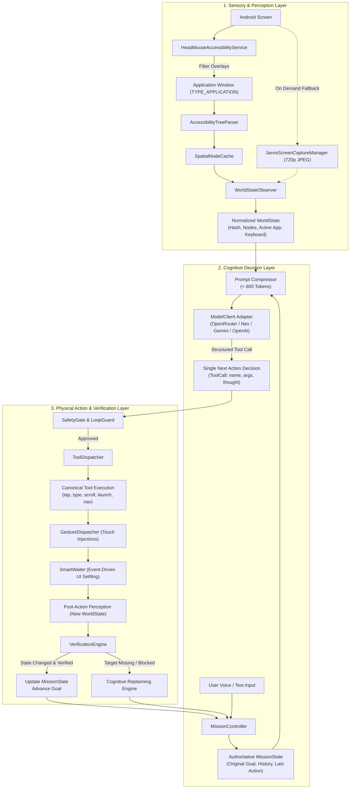

# Phase 1 Architecture Specification: J.A.R.V.I.S. Autonomous Agent

**Target Project:** HeadMotionMouse / J.A.R.V.I.S.  
**Working Directory:** `c:\Users\Admin\Documents\SYBSC\assignments\antigravity\HeadMotionMouse`  
**Mode:** ARCHITECTURAL DESIGN ONLY (Zero Production Source Code Modifications)  
**Date:** 2026-09-17  
**Grounding:** 100% Derived from Phase 0 Forensic Evidence  

---

## 1. Executive Summary & Architectural Paradigm Shift

Phase 0 proved that J.A.R.V.I.S. fails on compound missions (such as *"YouTube open karo, Shorts pe click karo"*, *"Settings mein jao aur flashlight dhoondho"*) because it currently operates on an obsolete **"Think once, build static plan, execute blindly"** model. Furthermore, common commands are intercepted by brittle, hardcoded static templates in `DynamicPlanner.kt`, overlay windows hijack the accessibility focus, and coordinate calculations apply double Y-offsets.

Phase 1 establishes the target architecture: a **True Continuous Screen-Aware Closed-Loop Agent**:

$$\text{OBSERVE} \longrightarrow \text{DECIDE NEXT SINGLE ACTION} \longrightarrow \text{ACT} \longrightarrow \text{WAIT/SETTLE} \longrightarrow \text{OBSERVE} \longrightarrow \text{VERIFY} \longrightarrow \text{UPDATE STATE} \longrightarrow \text{REPLAN / CONTINUE} \longrightarrow \text{COMPLETE}$$

```
┌────────────────────────────────────────────────────────────────────────────────────────────────────────┐
│                                     LEGACY vs. TARGET PARADIGM                                         │
├────────────────────────────────────────┬───────────────────────────────────────────────────────────────┤
│ LEGACY SYSTEM (Phase 0 Reality)        │ TARGET ARCHITECTURE (Phase 1 Design)                          │
├────────────────────────────────────────┼───────────────────────────────────────────────────────────────┤
│ • Think once: Generates all steps at   │ • Step-by-step cognitive loop: Decides ONE atomic action      │
│   the start.                           │   at a time based on the live, verified screen.              │
│ • Hardcoded templates for common tasks │ • Model-first planning: AI reasons through dynamic screens    │
│   (Shorts, Flashlight, Play Store).    │   with canonical tool calls.                                  │
│ • Iterates via `currentStepIndex++`.   │ • Perception-action feedback: Live screen after action $N$    │
│   Zero feedback to model.              │   is fed directly into decision for action $N+1$.             │
│ • Destructive goal splitting.          │ • Immutable original goal preserved throughout mission.       │
│ • Reads overlay window / stale cache.  │ • Active foreground TYPE_APPLICATION window isolation.        │
│ • 3,500 token uncompressed context.    │ • Compressed semantic index (< 800 tokens/request).           │
│ • 15s blocking HttpURLConnection.      │ • Decoupled ModelClient with 30s timeout and retries.         │
│ • Fragile regex `[ACTION:TAP:...]`.    │ • Deterministic, machine-validated JSON tool contracts.       │
└────────────────────────────────────────┴───────────────────────────────────────────────────────────────┘
```

---

## 2. High-Level Target Architecture Diagram



---

## 3. Subsystem Breakdown & Architectural Guarantees

### 1. `MissionController` (Replaces Fractured Orchestrators)
- **Eliminates:** The split between `AgentOrchestrator.kt`, `TaskOrchestrator.kt`, and `JarvisMissionExecutor.kt`.
- **Single Authority:** Exposes `startMission(goal)`, `stopMission()`, and `pauseMission()`.
- **Contract:** Owns the single active coroutine execution lock, the authoritative `MissionState`, and coordinates perception, model calling, tool dispatch, and verification.

### 2. `WorldStateObserver` (Active Window Isolation & Stale Cache Elimination)
- **Guarantees:**
  - Explicitly filters out `AccessibilityWindowInfo.TYPE_ACCESSIBILITY_OVERLAY` (Cursor Overlay and Arc Reactor HUD).
  - Selects the topmost interactive `AccessibilityWindowInfo.TYPE_APPLICATION` window.
  - Automatically invalidates `SpatialNodeCache` upon `TYPE_WINDOW_STATE_CHANGED` or `TYPE_WINDOWS_CHANGED` to ensure stale nodes are never read.
  - Generates a structural `screenHash` and content `accessibilityHash` to detect real UI transitions deterministically.

### 3. `ModelClient` (Provider-Neutral Decoupled Adapter)
- **Eliminates:** Hardcoded `AppSettings.kt:261` getter lock and raw `HttpURLConnection` calls inside `JarvisBrain.kt`.
- **Capabilities:** Supports OpenRouter, Nex N2.5 Pro, xKiro, Google Gemini, and OpenAI with uniform structured tool-calling schemas.
- **Resilience:** Implements 30-second read timeouts, connection pooling, and exponential backoff retry on 429/502/503 errors.

### 4. `ToolDispatcher` (Deterministic Canonical Action Execution)
- **Eliminates:** Brittle regex brackets (`[ACTION:TAP:...]`).
- **Contract:** Accepts validated `ToolCall(name, args)` and dispatches via Android Accessibility APIs.
- **Coordinate Precision:** Direct physical screen coordinates from `ScreenNode.bounds` without erroneous `windowOffsetY` shifts.
- **Asynchronous Completion:** Suspends until `GestureResultCallback.onCompleted()` fires, eliminating fire-and-forget race conditions.

### 5. `VerificationEngine` (Empirical Post-Action State Verification)
- **Eliminates:** Naive hardcoded `true` returns in `ScreenObserver.kt:82, 98`.
- **Contract:** Compares pre-action `WorldState` against post-settling `WorldState`:
  - `OPEN_APP`: Verifies foreground package matches target package.
  - `TAP`: Verifies targeted element disappeared, focused state changed, or screen hash mutated.
  - `TYPE_TEXT`: Verifies text appears inside the focused editable node.
  - `SCROLL`: Verifies node hierarchy scroll offset or screen content hash changed.

---

## 4. Mapping Phase 0 Root Causes to Phase 1 Architecture

| Phase 0 Confirmed Root Cause | Phase 1 Architectural Fix | Spec Document Reference |
|---|---|---|
| **Root Cause 1:** No Continuous Loop (`stepIndex++`) | Single-action loop: observe -> model decides 1 action -> act -> settle -> re-observe -> verify -> decide next. | `PHASE_1_AGENT_LOOP.md` |
| **Root Cause 2:** Static Templates Override LLM | Remove hardcoded `DynamicPlanner` templates; agent queries model with compressed screen state. | `PHASE_1_MODEL_CONTRACT.md` |
| **Root Cause 3:** Stale Nodes / Overlay Focus Hijack | `WorldStateObserver` ignores overlay windows; strictly binds to topmost `TYPE_APPLICATION`. | `PHASE_1_WORLD_STATE.md` |
| **Root Cause 4:** Destructive Compound Goal Splitting | `originalUserGoal` is immutable in `MissionState` and included in every model turn. | `PHASE_1_MISSION_STATE.md` |
| **Root Cause 5:** Double Y-Offset in Touch Injection | Remove `windowOffsetY` addition in `ToolDispatcher`; use absolute screen pixels. | `PHASE_1_TOOL_CONTRACT.md` |
| **Root Cause 6:** 72k Tokens & 15s Read Timeout | `PromptCompressor` keeps payloads < 800 tokens; `ModelClient` sets 30s read timeout with retry. | `PHASE_1_MODEL_CONTRACT.md` |
| **Preservation:** Assistive Mouse Co-existence | Keep CameraX 60 FPS, ML Kit face detection, `OneEuroFilter`, and dwell clicking 100% intact. | Section 5 of this Document |

---

## 5. Non-Regression & Assistive Mouse Preservation

The existing assistive head mouse system is 100% decoupled from the cognitive agent loop and will remain completely intact:
1. **Tracking Pipeline:** `FaceTrackerManager.kt`, `HeadPoseEngine.kt`, `LowPassFilter.kt`, `OneEuroFilter.kt` remain untouched.
2. **Cursor UI & Styles:** `CursorOverlayView.kt`, `CursorRenderer.kt` (all 10 cursor styles) remain untouched.
3. **Dwell Clicking & Keyboards:** `DwellClickDetector`, `KeyboardKeyDetector.kt` remain untouched.
4. **Dual Operating Modes:** `DualOperatingMode.kt` toggles ("Both Active", "Head Mouse Only", "J.A.R.V.I.S. Only", "Standby") remain 100% functional.
