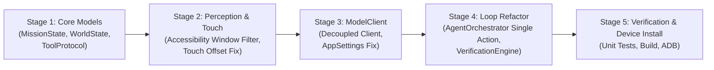

# Phase 1 Specification: Implementation & Migration Plan

**Target Project:** HeadMotionMouse / J.A.R.V.I.S.  
**Working Directory:** `c:\Users\Admin\Documents\SYBSC\assignments\antigravity\HeadMotionMouse`  
**Document:** `PHASE_1_MIGRATION_PLAN.md`  
**Date:** 2026-09-17  

---

## 1. Migration Overview & Non-Breaking Staging

The architectural migration from the legacy static planning model to the continuous closed-loop agent will be executed in **5 distinct, verifiable stages**. Every stage is guarded by compile-time and unit-test validation gates.

---

## 2. File Modification & Creation Inventory

```
c:\Users\Admin\Documents\SYBSC\assignments\antigravity\HeadMotionMouse\app\src\main\java\com\assistive\headmouse\
  ├── agent\jarvis\autonomous\
  │     ├── [NEW] state\MissionState.kt            <- Single authoritative mission state
  │     ├── [NEW] state\WorldState.kt              <- Normalized screen perception model
  │     ├── [NEW] tools\ToolProtocol.kt            <- 12 canonical tool definitions & ActionResult
  │     ├── [NEW] tools\ToolDispatcher.kt          <- Dispatches physical tools with async callbacks
  │     ├── [NEW] model\ModelClient.kt             <- Abstracted provider-neutral client & factory
  │     ├── [NEW] verification\VerificationEngine.kt <- Empirical pre/post state verifier
  │     ├── [MODIFY] AgentOrchestrator.kt          <- Implements the single-action closed loop
  │     ├── [MODIFY] DynamicPlanner.kt             <- Eliminates static templates, delegates to ModelClient
  │     └── [DELETE / DEPRECATE] action\TaskOrchestrator.kt <- Removes dead legacy duplicate orchestrator
  ├── service\
  │     └── [MODIFY] HeadMouseAccessibilityService.kt <- Fixes overlay window filter & removes windowOffsetY
  └── preferences\
        └── [MODIFY] AppSettings.kt                <- Fixes hardcoded aiProvider getter bug (Line 261)
```

---

## 3. Step-by-Step Implementation Sequence



### Stage 1: Foundation Data Contracts (Zero Side-Effects)
- Create `MissionState.kt`, `WorldState.kt`, and `ToolProtocol.kt`.
- Establishes immutable `originalUserGoal` and canonical 12 tools without touching running services.
- **Verification Gate:** Run `./gradlew.bat compileDebugKotlin` to verify zero syntax/type errors.

### Stage 2: Perception & Physical Injection Repairs
- **In `HeadMouseAccessibilityService.kt`**:
  1. Fix `refreshSpatialCacheSync()`: filter out `TYPE_ACCESSIBILITY_OVERLAY` and `TYPE_APPLICATION_OVERLAY`, targeting the true topmost `TYPE_APPLICATION` window.
  2. Fix `executeActionAt()`: remove the erroneous `windowOffsetY` addition so touches land exactly on target bounds.
  3. Ensure `SpatialNodeCache` is invalidated on `TYPE_WINDOW_STATE_CHANGED` so stale nodes are never read.
- **Verification Gate:** Run `./gradlew.bat testDebugUnitTest` to verify no regressions in gesture dispatching.

### Stage 3: Universal `ModelClient` & Provider Resolution
- Create `ModelClient.kt` with OpenRouter, Nex N2.5 Pro, xKiro, and Gemini adapters.
- Implement structured tool-calling serialization and 30-second read timeouts with retries.
- Fix `AppSettings.kt:261` to return the user's active provider selection instead of hardcoded `CUSTOM_OPENROUTER`.
- **Verification Gate:** Run `./gradlew.bat compileDebugKotlin`.

### Stage 4: Continuous Closed-Loop Agent Orchestration
- Refactor `AgentOrchestrator.kt`:
  1. Replace the legacy `while (currentStepIndex < steps.size)` pre-planned loop with the dynamic loop:
     `Observe WorldState -> Decide Next Single Action (ModelClient) -> Execute Action (ToolDispatcher) -> Wait Settling (SmartWaiter) -> Observe Post-State -> Verify (VerificationEngine) -> Replan/Complete`.
  2. Strip hardcoded static templates in `DynamicPlanner.kt`.
  3. Wire `VerificationEngine.kt` to compare pre- and post-action `WorldState`.
  4. Deprecate / remove orphan `TaskOrchestrator.kt`.
- **Verification Gate:** Run unit tests covering compound multi-step workflows.

### Stage 5: End-to-End Build & Deployment
- Run full `./gradlew.bat testDebugUnitTest`.
- Run `./gradlew.bat assembleDebug`.
- Deploy APK to the connected device (`realme P1 5G`, `I7ZTUSUGYXKRWS4H`).
- Verify that assistive head-tracking mouse, dwell clicking, and camera pipeline remain 100% operational.
