# Phase 1 Specification: Authoritative Mission State

**Target Project:** HeadMotionMouse / J.A.R.V.I.S.  
**Working Directory:** `c:\Users\Admin\Documents\SYBSC\assignments\antigravity\HeadMotionMouse`  
**Document:** `PHASE_1_MISSION_STATE.md`  
**Date:** 2026-09-17  

---

## 1. The Single Authoritative `MissionState`

In the legacy implementation, mission state was fragmented across `GoalManager` (subgoal strings), `AgentOrchestrator` (`TaskStateMachine`), `JarvisMissionExecutor` (`MissionStatus`), and `JarvisMemoryManager` (flat JSON dialogue history). This fragmentation caused high-level goals to be overwritten by intermediate steps.

In the target architecture, **exactly ONE authoritative `MissionState` instance** exists per mission, encapsulated within `MissionController`.

### Core Invariant: Goal Preservation Rule
> **`originalUserGoal` is immutable.** It is set once upon initialization and can NEVER be overwritten, truncated, or replaced by intermediate subgoals.

---

## 2. Kotlin Data Schema

```kotlin
package com.assistive.headmouse.agent.jarvis.autonomous.state

import com.assistive.headmouse.agent.jarvis.autonomous.tools.ToolCall
import com.assistive.headmouse.agent.jarvis.autonomous.tools.ActionResult
import java.util.UUID

/**
 * High-level status of an autonomous mission.
 */
enum class MissionStatus {
    IDLE,
    INITIALIZING,
    OBSERVING,
    THINKING,
    EXECUTING,
    WAITING_SETTLING,
    VERIFYING,
    REPLANNING,
    PAUSED,
    COMPLETED,
    FAILED,
    CANCELLED
}

/**
 * Represents a verifiable sub-goal in a compound mission.
 */
data class Subgoal(
    val id: String = UUID.randomUUID().toString().take(8),
    val description: String,
    val targetPackage: String? = null,
    val expectedOutcome: String? = null,
    var isCompleted: Boolean = false,
    var failureReason: String? = null
)

/**
 * The single source of truth for an active autonomous mission.
 */
data class MissionState(
    // 1. Mission Identifiers & Immutable Goal
    val missionId: String = "mission_${System.currentTimeMillis()}_${UUID.randomUUID().toString().take(6)}",
    val originalUserGoal: String, // IMMUTABLE: Never altered after creation
    
    // 2. Goal Decomposition & Objectives
    var currentSubgoal: Subgoal?,
    val completedObjectives: MutableList<Subgoal> = mutableListOf(),
    val remainingObjectives: MutableList<Subgoal> = mutableListOf(),

    // 3. Perception State
    var currentObservation: WorldState? = null,
    var previousObservation: WorldState? = null,

    // 4. Action & Execution Tracking
    var lastAction: ToolCall? = null,
    var lastActionResult: ActionResult? = null,
    var expectedPostcondition: String? = null,
    var verifiedState: Boolean = false,

    // 5. Watchdog & Reliability Metrics
    var failureCount: Int = 0,
    var consecutiveFailedActions: Int = 0,
    var modelDecisionCount: Int = 0,
    val missionStartTime: Long = System.currentTimeMillis(),
    var lastActionTimestamp: Long = 0L,

    // 6. Overall Status
    var status: MissionStatus = MissionStatus.IDLE,
    var statusMessage: String = "Initialized"
) {
    /**
     * Total elapsed mission duration in milliseconds.
     */
    val elapsedDurationMs: Long
        get() = System.currentTimeMillis() - missionStartTime

    /**
     * Checks whether the mission duration or iteration budgets have been exceeded.
     */
    fun isBudgetExceeded(maxDurationMs: Long = 180_000L, maxModelDecisions: Int = 25): Boolean {
        return elapsedDurationMs > maxDurationMs || modelDecisionCount >= maxModelDecisions
    }

    /**
     * Safely advances from the current completed subgoal to the next pending subgoal.
     */
    fun advanceSubgoal() {
        currentSubgoal?.let { completed ->
            completed.isCompleted = true
            completedObjectives.add(completed)
        }
        currentSubgoal = if (remainingObjectives.isNotEmpty()) {
            remainingObjectives.removeAt(0)
        } else {
            null
        }
    }
}
```

---

## 3. Mission Lifecycle State Transitions

```mermaid
stateDiagram-v2
    [*] --> IDLE
    IDLE --> INITIALIZING : startMission(userGoal)
    INITIALIZING --> OBSERVING : WorldState captured
    
    state "Autonomous Closed Loop" as Loop {
        OBSERVING --> THINKING : Screen compressed & sent to ModelClient
        THINKING --> EXECUTING : Model returns ToolCall
        EXECUTING --> WAITING_SETTLING : Gesture injected via Accessibility
        WAITING_SETTLING --> OBSERVING_POST : UI settle / window change detected
        OBSERVING_POST --> VERIFYING : VerificationEngine compares WorldStates
        
        VERIFYING --> REPLANNING : Postcondition failed / Target missing
        REPLANNING --> THINKING : Updated observation fed back
        
        VERIFYING --> ADVANCING : Action verified & state mutated
        ADVANCING --> OBSERVING : Subgoal remaining
    }
    
    ADVANCING --> COMPLETED : All objectives fulfilled / finish_task tool
    REPLANNING --> FAILED : Max retries (3) exceeded / Unrecoverable
    Loop --> CANCELLED : User interrupt ("stop", "cancel")
    Loop --> FAILED : Timeout (>180s) or Loop detected
    
    COMPLETED --> [*]
    FAILED --> [*]
    CANCELLED --> [*]
```



---

## 4. Concurrency & Thread-Safety Guarantees

1. **State Mutation Lock**:
   - `MissionState` is encapsulated inside `MissionController`.
   - All mutations occur within a dedicated Kotlin Coroutine single-threaded execution context (`Dispatchers.Default` with an internal state mutex) to prevent concurrent modification exceptions between voice inputs and accessibility events.
2. **Atomic Snapshot Sharing**:
   - When the UI (Floating Arc Reactor HUD or `MainActivity`) requests state, `MissionController` returns an immutable, read-only snapshot `MissionStateSnapshot` via Kotlin `StateFlow<MissionStateSnapshot>`.
3. **Emergency Interruption Non-Blocking Guarantee**:
   - `cancelMission()` signals `activeJob.cancel()`.
   - The mission state transitions immediately to `MissionStatus.CANCELLED` within < 50ms without waiting for downstream HTTP sockets or gesture completion.
