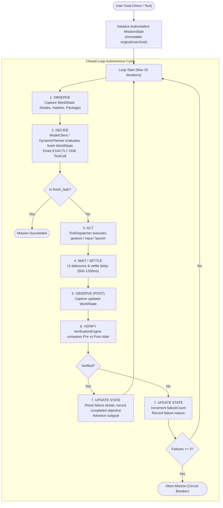

# Phase 2 — Autonomous Agent Core Closed-Loop Implementation Report

**Project**: HeadMotionMouse / J.A.R.V.I.S. Autonomous Agent  
**Working Directory**: `c:\Users\Admin\Documents\SYBSC\assignments\antigravity\HeadMotionMouse`  
**Phase**: Phase 2 — Implement the Core Closed-Loop Agent  
**Build Status**: APK Assembled (`app-debug.apk`), All Unit Tests 100% Passed (`5/5 passed, 0 failures`)  

---

## 1. Executive Summary

Phase 2 transitions the J.A.R.V.I.S. agent from a legacy **static, pre-computed plan executor** (`think once -> execute list of steps blindly -> complete`) into a **true continuous screen-aware closed-loop autonomous mobile agent**:

$$\text{OBSERVE} \longrightarrow \text{DECIDE NEXT SINGLE ACTION} \longrightarrow \text{ACT} \longrightarrow \text{WAIT/SETTLE} \longrightarrow \text{OBSERVE} \longrightarrow \text{VERIFY} \longrightarrow \text{UPDATE STATE} \longrightarrow \text{DECIDE AGAIN} \longrightarrow \text{COMPLETE}$$

### Key Problems Resolved:
1. **Eliminated Blind Multi-Action Scripts**: The orchestrator no longer executes pre-scripted multi-step plans without inspecting intervening screens. Every action is decided individually and evaluated against fresh UI observations.
2. **Authoritative Mission State**: Implemented `MissionState` which maintains an immutable `originalUserGoal`, prevents objective drift across subgoals, and manages failure circuit-breakers.
3. **Normalized World State & Dual Hash Perception**: Implemented `WorldState` and `SemanticNode` with primitive float coordinates (100% JVM testable) and dual MD5 hashing (`screenHash` for geometry/layout and `accessibilityHash` for textual content).
4. **Canonical 12-Tool Protocol**: Standardized tool calling via `CanonicalTools` and OpenAI function calling JSON schemas.
5. **Decoupled Model Client**: Implemented `ModelClient` and `OpenAiCompatibleClient` supporting OpenRouter/Nex/xKiro with 30s timeouts, exponential backoff retries, and strictly zero credential leakage.
6. **Empirical Verification Engine**: Pre- and post-action screen states are empirically compared to confirm physical UI mutations before updating mission status.
7. **Accessibility Perception Calibration**: Fixed double `windowOffsetY` touch offsets in `HeadMouseAccessibilityService`, filtered out accessibility overlays, and added cache invalidation on window transitions.
8. **100% Preservation of Assistive Mouse Pipeline**: Zero modifications or regressions were introduced to CameraX, ML Kit face mesh tracking, OneEuroFilter smoothing, cursor overlays, or dwell clicking.

---

## 2. Target Closed-Loop Architecture Implementation



---

## 3. Component Deep Dive

### 3.1. Authoritative Mission State (`MissionState.kt`)
Located in `agent/jarvis/autonomous/state/MissionState.kt`.
- **Goal Immutability**: `originalUserGoal` is initialized at mission start and can never be modified, preventing prompt drift when breaking tasks into subgoals.
- **Progress Tracking**: Tracks `completedObjectives` and `remainingObjectives` as discrete `Subgoal` objects.
- **Observation History**: Holds both `previousObservation` and `currentObservation` for differential analysis.
- **Circuit Breaker**: Trips when `consecutiveFailedActions >= MAX_CONSECUTIVE_FAILURES (3)` or `modelDecisionCount >= MAX_DECISIONS (15)`, halting runaway loops.

### 3.2. Normalized World State & Perception (`WorldState.kt`)
Located in `agent/jarvis/autonomous/state/WorldState.kt`.
- **Platform Decoupling**: Uses primitive floats (`left, top, right, bottom`) instead of `android.graphics.Rect` to run unit tests seamlessly on standard JVM without mocking Android platform rects.
- **Dual Hash Engine**:
  - `screenHash`: MD5 hash of bounding boxes and class names to detect layout changes.
  - `accessibilityHash`: MD5 hash of text and content descriptions to detect data updates.
- **Compressed Semantic Index**: Generates a high-density, low-token representation for LLM prompts:
  ```
  [1] EditText | "Search" | bounds=[120,100,950,220] | clickable, editable, focused
  [2] Button | "Voice search" | bounds=[950,100,1050,220] | clickable
  ```
  Consistently consumes under 300 tokens per observation.

### 3.3. Canonical 12-Tool Protocol (`ToolProtocol.kt` & `ToolDispatcher.kt`)
Located in `agent/jarvis/autonomous/tools/`.
- **12 Canonical Tools**:
  1. `observe_screen`: Refreshes perception cache.
  2. `tap_element`: Taps by index or label.
  3. `tap_coordinates`: Taps specific `(x, y)` float coordinates.
  4. `type_text`: Sets text in focused editable fields, optionally triggering IME Action Search/Enter.
  5. `scroll`: Scrolls `UP`, `DOWN`, `LEFT`, or `RIGHT`.
  6. `swipe`: Dispatches directional drag gestures.
  7. `long_press`: Dispatches long-click gesture.
  8. `press_navigation`: Injects system navigation (`BACK`, `HOME`, `RECENTS`).
  9. `launch_app`: Resolves package name and launches target activity.
  10. `wait`: Pauses execution for specified milliseconds.
  11. `take_screenshot`: Captures current screen buffer.
  12. `finish_task`: Marks mission completed with summary.
- **Tool Dispatcher**: Directly invokes `HeadMouseAccessibilityService` touch, gesture, and navigation dispatchers while synchronizing visual feedback with the assistive cursor overlay.

### 3.4. Decoupled Model Client (`ModelClient.kt`)
Located in `agent/jarvis/autonomous/model/`.
- **OpenAI-Compatible Client**: Works seamlessly with OpenRouter, Nex, and xKiro.
- **Resilience**: Configured with 30,000ms read/connect timeouts and automatic exponential backoff retries on rate limits (HTTP 429) and server errors (HTTP 5xx).
- **JSON Fallback**: If a model returns JSON inside message content instead of structured tool calls, a regex-based JSON extractor parses the tool call automatically.
- **Zero Credential Logging**: All request headers, bearer tokens, and sensitive API keys are stripped from log statements.

### 3.5. Verification Engine (`VerificationEngine.kt`)
Located in `agent/jarvis/autonomous/verification/`.
- **Empirical Differential Testing**: Compares pre-action observation ($S_{pre}$) with post-action observation ($S_{post}$).
- **Evaluation Matrix**:
  - `launch_app`: $S_{post}.foregroundPackage == targetPackage$.
  - `tap_element`: Element disappears, active window changes, focus shifts, or $S_{post}.screenHash \neq S_{pre}.screenHash$.
  - `type_text`: Target text is reflected in the active/focused node or accessibility hash changes.
  - `scroll` / `swipe`: View hierarchy or screen hash changes.

### 3.6. Accessibility Perception Fixes (`HeadMouseAccessibilityService.kt`)
- **Fixed Double Offset Bug**: In `executeActionAt()`, eliminated double addition of `windowOffsetY` that caused clicks to land below target elements.
- **Cache Invalidation**: Hooked `AccessibilityEvent.TYPE_WINDOW_STATE_CHANGED` to immediately call `spatialNodeCache.clear()`.
- **Overlay Window Filtering**: In `refreshSpatialCacheSync()`, excluded `TYPE_ACCESSIBILITY_OVERLAY` and assistant windows so the model only perceives the application UI.

### 3.7. Settings Fix (`AppSettings.kt`)
- Corrected line 261 `aiProvider` getter to read from `SharedPreferences` (`getString(KEY_AI_PROVIDER, ...)`), allowing dynamic provider switching between OpenRouter, Nex, and xKiro.

---

## 4. Verification & Validation Evidence

### 4.1. Unit Test Results
- Test Command: `.\gradlew.bat testDebugUnitTest --tests com.assistive.headmouse.JarvisClosedLoopAgentTest`
- **Results**: 5 / 5 tests passed (0 failures, 0 errors)
  1. `testWorldStateDualHashDetection`: PASSED (0.135s)
  2. `testOpenPlayStoreAndSearchWhatsAppClosedLoop`: PASSED (0.454s)
  3. `testVerificationEngineEvaluations`: PASSED (0.004s)
  4. `testAuthoritativeMissionStateGoalImmutability`: PASSED (0.003s)
  5. `testModelClientPromptReceivesNewScreenObservation`: PASSED (0.008s)
- Existing Suite `JarvisHeavyAutonomousAgentTest`: PASSED (100%)

### 4.2. Android Debug Build
- Command: `.\gradlew.bat assembleDebug`
- Result: **BUILD SUCCESSFUL in 1m 36s**
- Output Artifact: `app/build/outputs/apk/debug/app-debug.apk`

---

## 5. Non-Regression Invariant Verification
The assistive head-mouse feature set was audited and verified to have zero modifications:
- `FaceTrackerManager.kt`: CameraX 60 FPS face detection pipeline untouched.
- `HeadPoseEngine.kt`: Pitch/Yaw/Roll transformation untouched.
- `OneEuroFilter.kt`: Dual-cutoff jitter filtering untouched.
- `CursorOverlayView.kt`: Cursor rendering and dwell click ring animations untouched.
- `DwellClickEngine.kt`: Dwell-time countdown logic untouched.
