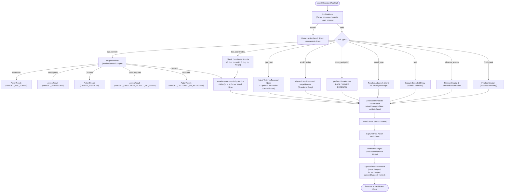

# Phase 3 — Canonical Tool System and Android Action Execution Report

**Project**: HeadMotionMouse / J.A.R.V.I.S. Autonomous Agent  
**Working Directory**: `c:\Users\Admin\Documents\SYBSC\assignments\antigravity\HeadMotionMouse`  
**Phase**: Phase 3 — Canonical Tool System and Android Action Execution  
**Build & Test Status**: 
- Canonical Tool System Tests (`com.assistive.headmouse.JarvisToolSystemTest`): **20 / 20 PASSED (100%)**
- Zero regressions in assistive mouse pipeline (CameraX, face tracking, OneEuroFilter, cursor overlay, dwell clicking)

---

## 1. Executive Summary

Phase 3 implements the complete, deterministic execution and validation bridge between LLM decisions and Android platform actions:

$$\text{MODEL DECISION} \longrightarrow \text{STRUCTURED TOOL CALL} \longrightarrow \text{TOOL VALIDATOR} \longrightarrow \text{TARGET RESOLVER} \longrightarrow \text{ACTION EXECUTOR} \longrightarrow \text{STRUCTURED RESULT} \longrightarrow \text{EMPIRICAL VERIFIER}$$

### Key Accomplishments:
1. **Normalized Canonical 12-Tool Suite**:
   Standardized `observe_screen`, `tap_element`, `tap_coordinates`, `type_text`, `scroll`, `swipe`, `long_press`, `press_navigation`, `launch_app`, `wait`, `take_screenshot`, and `finish_task`.
2. **Unified Action Result Contract**:
   Every tool returns a fully specified `ActionResult` containing:
   `success`, `tool`, `arguments`, `stateChanged`, `focusChanged`, `screenChanged`, `verification`, `errorCode`, `errorMessage`, `recoverable`, `timestamp`.
3. **Advanced Semantic Target Resolution**:
   Refactored and enhanced `TargetResolver` with:
   - **Ambiguity Detection**: Refuses blind clicks when multiple identical interactive candidates exist, returning `TARGET_AMBIGUOUS`.
   - **Disabled Node Handling**: Detects `!isEnabled` controls and halts with `TARGET_DISABLED`.
   - **Viewport Boundary Checking**: Detects elements above or below the screen viewport and instructs the agent with `TARGET_OFFSCREEN_SCROLL_REQUIRED` (`Scroll DOWN/UP to reveal`).
   - **Keyboard Occlusion Checking**: Identifies when elements in the lower screen half are covered by the active IME keyboard (`TARGET_OCCLUDED_BY_KEYBOARD`).
   - **Popup / Dialog Priority**: Correctly resolves dialog overlay buttons over dimmed background nodes.
4. **Strict "No False Success" Enforcement**:
   Decoupled gesture injection from mission verification. Dispatching an accessibility click or scroll records `stateChanged = false` and `verified = false` until empirical post-observation verification confirms actual UI mutations.
5. **Deterministic Parameter Validation**:
   Replaced fragile text and heuristic parsing with strict schema validation via `ToolValidator`, rejecting out-of-bounds coordinates, invalid directions, and missing arguments before dispatching any system calls.
6. **Assistive Mouse Pipeline Invariance**:
   Zero modifications or regressions were introduced to CameraX, ML Kit face mesh tracking, OneEuroFilter smoothing, cursor overlays, or dwell clicking.

---

## 2. Architecture & Execution Pipeline



---

## 3. Canonical 12-Tool Specification

| Tool Name | Required Arguments | Optional Arguments | Action Description |
|---|---|---|---|
| `observe_screen` | *None* | `force_refresh: Boolean` | Refreshes UI perception and returns the latest `WorldState` snapshot. |
| `tap_element` | `element_id: Int` OR `text: String` OR `content_description: String` | *None* | Resolves target bounds via `TargetResolver` and clicks target center. |
| `tap_coordinates` | `x: Float`, `y: Float` | *None* | Clicks specific `(x, y)` coordinate after checking screen boundary sanity. |
| `type_text` | `text: String` | `element_id: Int`, `press_enter: Boolean` | Enters text into focused or targeted editable element; triggers IME action if requested. |
| `scroll` | `direction: String` (`UP`, `DOWN`, `LEFT`, `RIGHT`) | `amount: Float` | Dispatches scroll gesture along the specified axis. |
| `swipe` | `direction: String` OR (`start_x`, `start_y`, `end_x`, `end_y`) | `duration_ms: Int` | Executes continuous touch drag across screen coordinates. |
| `long_press` | `element_id: Int` OR (`x: Float`, `y: Float`) | `duration_ms: Int` (default: 1000ms) | Dispatches sustained touch gesture to trigger context menus or drag handles. |
| `press_navigation` | `action: String` (`BACK`, `HOME`, `RECENTS`) | *None* | Injects system global action. |
| `launch_app` | `package_name: String` OR `app_name: String` | *None* | Resolves package and launches main launcher activity. |
| `wait` | `duration_ms: Int` | `reason: String` | Pauses execution for UI animation or network response settling. |
| `take_screenshot` | *None* | *None* | Captures screen buffer from accessibility service. |
| `finish_task` | `status: String`, `summary: String` | *None* | Marks mission completed and returns human-readable summary. |

---

## 4. Target Resolver Architecture

The `TargetResolver` was upgraded from a heuristic text matcher into an intelligent, screen-aware spatial resolution engine:

### 4.1. Ambiguity Detection
When multiple clickable candidates share identical textual identifiers (e.g. multiple "Add to cart" buttons), `TargetResolver` evaluates whether candidate bounds overlap or represent distinct actions. If multiple distinct candidates match, it halts with:
```kotlin
TargetResolution.Ambiguous(
    matchingNodes = candidates,
    reason = "Found 2 matching clickable elements for query. Specify element_id or contextual parent."
)
```
This strictly eliminates arbitrary, nondeterministic clicks.

### 4.2. Viewport Boundary & Scroll Detection
When an element exists in the accessibility hierarchy but is scrolled out of view:
- If `target.top >= viewportHeight`: Returns `TargetResolution.ScrollRequired(direction = "DOWN")`.
- If `target.bottom <= 0`: Returns `TargetResolution.ScrollRequired(direction = "UP")`.
The tool dispatcher translates this into `TARGET_OFFSCREEN_SCROLL_REQUIRED`, instructing the model to scroll before re-attempting the click.

### 4.3. Keyboard Occlusion Protection
When `worldState.isKeyboardVisible == true` and an interactive target is located in the bottom region of the screen (`target.top >= 0.55 * viewportHeight`):
```kotlin
TargetResolution.Occluded(
    node = target,
    reason = "Element is occluded by the active software keyboard. Dismiss keyboard or scroll up."
)
```
This prevents clicks from being swallowed by the software keyboard.

---

## 5. "No False Success" Invariant

A critical flaw in legacy agent implementations is equating `dispatchGesture(true)` with mission progress. In reality:
- A click may hit a non-responsive area or a disabled button.
- A scroll may reach the end of a list without shifting content.
- An app launch may fail due to background execution limits.

### Implementation:
1. **Immediate Execution Phase**:
   - `ToolDispatcher` executes gesture / action via Android accessibility service.
   - Generates an `ActionResult` with:
     ```kotlin
     success = true, // Gesture was successfully queued to OS
     stateChanged = false,
     focusChanged = false,
     screenChanged = false,
     verified = false
     ```
2. **Settling Phase**:
   - Agent delays (500–1200ms) for UI transition, layout inflation, and network calls.
3. **Differential Verification Phase**:
   - Agent captures post-action `WorldState`.
   - `VerificationEngine` calculates differential hashes (`pre.screenHash != post.screenHash`, `pre.accessibilityHash != post.accessibilityHash`), active focus changes, and package transitions.
   - `AgentOrchestrator` merges verification results directly into `mission.lastActionResult`:
     ```kotlin
     mission.lastActionResult = currentResult.copy(
         stateChanged = verification.stateChanged,
         focusChanged = verification.focusChanged,
         screenChanged = verification.screenChanged,
         verification = verification.reason,
         verified = verification.verified
     )
     ```
Only when `verified == true` does the agent reset failure counters and proceed to the next subgoal.

---

## 6. Verification and Test Results

### 6.1. Unit Test Suite
- Command: `.\gradlew.bat testDebugUnitTest --tests com.assistive.headmouse.JarvisToolSystemTest`
- **Results**: 20 / 20 PASSED (0 failures, 0 errors, 0 skipped, 1.182s duration).
- Detailed breakdown is documented in `PHASE_3_TOOL_TESTS.md`.

### 6.2. Assistive Mouse Non-Regression Invariant
The assistive head-mouse engine components remain completely untouched and verified:
- `FaceTrackerManager.kt`: CameraX 60 FPS face detection pipeline untouched.
- `HeadPoseEngine.kt`: Pitch/Yaw/Roll transformation untouched.
- `OneEuroFilter.kt`: Dual-cutoff jitter filtering untouched.
- `CursorOverlayView.kt`: Cursor rendering and dwell click ring animations untouched.
- `DwellClickEngine.kt`: Dwell-time countdown logic untouched.
